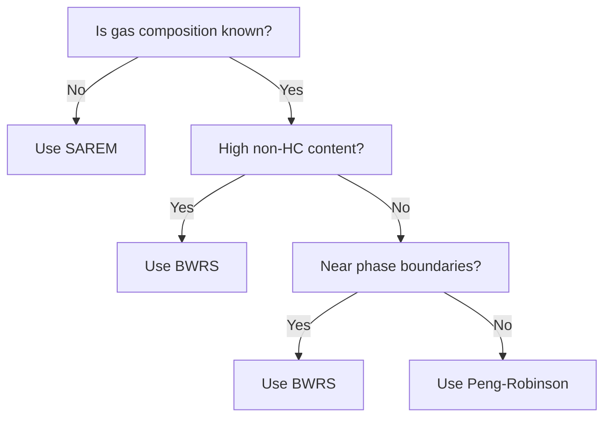

## Day 2: Steady-State Simulation and Model Building

**Objective:** To master the process of building detailed network models, performing steady-state simulations, and analyzing pipeline capacity.

**Morning Session Focus:** Model building techniques and parameter input  
**Afternoon Session Focus:** Steady-state simulation and capacity analysis

---

### **Module 1: Advanced Simulation Parameters (Chapter 3 Continued)**

#### **1.1 Friction Formula Selection**

> 📖 **Essential Reference:** PDF Module Tuning, Case Study 1C (pages 20-22) demonstrates the impact of different friction formulas on flow calculations.

**Decision Matrix for Friction Formula Selection:**

| Condition | Recommended Formula | Rationale |
|-----------|-------------------|-----------|
| General purpose, all conditions | Colebrook White | Most accurate, wide applicability |
| Low pressure systems (<100 psig) | Weymouth | Designed for low pressure |
| Large diameter (>24"), long distance | Panhandle B | Optimized for transmission |
| Medium diameter (6-24") | Panhandle A | Good for distribution systems |
| Rough pipes, fully turbulent | AGA | Considers wall roughness only |

**Knot Spacing Guidelines:**
- **High accuracy required:** 0.5-1 mile spacing
- **Standard models:** 5-10 mile spacing  
- **Very large networks:** 10-20 mile spacing
- **Temperature tracking enabled:** Use smaller spacing (impacts thermal calculations)

> 📖 **Practice Exercise:** PDF Module Capacity, Case Study 1A (pages 11-12) shows knot spacing effects on results.

#### **1.2 Gas State Equation Selection**

**Quick Selection Guide:**



**Computational Impact:**
- SAREM: Baseline speed (1x)
- Peng-Robinson: ~2-3x slower
- BWRS: ~5-10x slower

---

### **Module 2: Building Complex Network Models (Chapter 4)**

#### **2.1 Gas Parameter Input Methods**

**Method 1: Simplified Fluid**
- **When to use:** Unknown composition, typical pipeline gas
- **Required inputs:** SG, HV, CO₂%
- **Limitation:** Must use SAREM equation

**Method 2: Compositional Fluid**
- **When to use:** Known composition, quality tracking needed
- **Required:** Component mole percentages (must sum to 100%)
- **Advantage:** Enables gas mixing calculations

> 📖 **Quality Tracking Exercise:** PDF Module Quality Tracking, Case Study 1 (pages 1-5) demonstrates compositional fluid setup and mixing.

#### **2.2 Efficient Model Building Techniques**

**Four-Method Approach for Parameter Input:**

1. **Component Dialog (Best for small models)**
   - Double-click each component
   - Intuitive but time-consuming
   - Use for <10 components

2. **Table View (Best for batch input)**
   - Access via Table Toolbar
   - Efficient for similar components
   - Use "Set To" for multiple selections

3. **Property View (Best for verification)**
   - View network and properties simultaneously
   - Three tabs: All/Input/Output
   - Ideal for checking results

4. **Format Painter (Best for replication)**
   - Copy all properties except length
   - Hold Ctrl+Shift to duplicate sections
   - Pin feature for multiple applications

> 📖 **Efficiency Tip:** PDF Module Tuning, Case Study 1B (pages 13-17) demonstrates efficient parameter tuning using tables.

#### **2.3 Model Validation Process**

**Pre-Simulation Checklist:**
```
□ Network connectivity verified
□ All required parameters entered
□ Boundary conditions defined
□ Units consistent throughout
□ Fluid properties specified
□ Temperature settings configured
□ Elevation data entered (if applicable)
```

**Common Validation Errors and Solutions:**

| Error Type | Common Cause | Solution |
|------------|--------------|----------|
| Unconnected subnet | Missing pipe connection | Check node connections |
| Missing constraint | No pressure/flow boundary | Add supply/delivery constraint |
| Over-constrained | Too many fixed values | Remove redundant constraints |
| Invalid data | Out-of-range values | Check units and magnitudes |

---

### **Module 3: Steady-State Simulation and Analysis**

#### **3.1 Running Steady-State Simulations**

**Convergence Monitoring:**
- Watch iteration error curves
- All curves should trend downward
- Convergence achieved when within tolerance

**Troubleshooting Non-Convergence:**

1. **Pressure Issues**
   - Increase supply pressure
   - Reduce delivery flow requirements
   - Check for pressure constraint conflicts

2. **Flow Issues**
   - Verify pipe sizing adequate
   - Check for flow reversals
   - Reduce flow constraints

3. **Network Issues**
   - Simplify constraints initially
   - Add constraints incrementally
   - Verify network connectivity

> 📖 **Convergence Practice:** PDF Module Tuning, Case Study 1B (pages 13-17) shows iterative tuning for convergence.

#### **3.2 Results Analysis**

**Key Output Parameters to Review:**
- Pressure at all nodes
- Flow rates and velocities
- Temperature profiles (if tracked)
- Compressor power requirements
- Line pack values

**Results Visualization Options:**
1. **Data Blocks** - On-diagram display
2. **Output Tables** - Detailed tabular data
3. **Property View** - Component-specific results
4. **Charts** - Profiles and trends
5. **Reports** - Comprehensive documentation

---

### **Module 4: Pipeline Capacity Analysis**

> 📖 **Core Exercise:** Complete PDF Module Capacity, Case Study 1 (pages 1-7) for comprehensive capacity analysis.

#### **4.1 Steady-State Capacity Determination**

**Definition:** Maximum flow rate maintainable under equilibrium conditions

**Capacity Limiting Factors:**
1. **Pressure constraints** - Minimum delivery pressures
2. **Velocity limits** - Erosion concerns (typically <60 ft/s)
3. **Compressor limits** - Power or speed constraints
4. **Pipe hydraulics** - Friction losses

**Capacity Enhancement Methods:**

| Method | Effect | Cost | Implementation Time |
|--------|--------|------|---------------------|
| Add loops | 40-70% increase | High | Long |
| Add compression | 20-40% increase | Medium | Medium |
| Increase pressure | 10-20% increase | Low | Quick |
| Reduce roughness | 5-15% increase | Low | Medium |

#### **4.2 Loop Placement Optimization**

> 📖 **Essential Exercise:** PDF Module Capacity, Case Study 1A (pages 7-13) demonstrates loop placement effects.

**Loop Placement Principles:**
1. **Bottleneck Priority** - Loop the smallest diameter first
2. **Thermal Considerations** - Upstream loops provide more cooling
3. **Pressure Profile** - Consider pressure drop distribution
4. **Future Expansion** - Plan for additional delivery points

**Loop Effectiveness Formula:**
$$\text{Capacity Increase} = \left(\frac{D_{eq}}{D_{original}}\right)^{2.5} - 1$$

Where equivalent diameter:
$$D_{eq} = \left(D_1^{2.5} + D_2^{2.5}\right)^{0.4}$$

---

### **Module 5: Laboratory Exercises - Day 2**

#### **Lab 2.1: Model Building and Tuning**
> 📖 **Complete:** PDF Module Tuning, Case Study 1B (pages 13-17)
- Build 50-mile pipeline model
- Tune roughness for target flow (2000 MMSCFD)
- Document iteration process
- Achieve convergence

**Expected Results:**
- Required roughness: ~0.000171 inches
- 5-8 iterations typical
- Pressure-pressure configuration

#### **Lab 2.2: Steady-State Capacity Analysis**
> 📖 **Complete:** PDF Module Capacity, Case Study 1 (pages 1-7)
- Three-segment pipeline model
- Determine baseline capacity
- Add single loop at different locations
- Compare capacity increases

**Expected Results:**
- Loop at bottleneck: ~41% increase
- Loop at large pipe: <2% increase
- Demonstrates bottleneck importance

#### **Lab 2.3: Temperature Effects on Capacity**
> 📖 **Complete:** PDF Module Capacity, Case Study 1A (pages 7-13)
- Enable temperature tracking
- Compare loop placement with thermal effects
- Analyze cooling benefits
- Document temperature profiles

**Key Observations:**
- Upstream loops provide system-wide cooling
- Temperature affects density and capacity
- Smaller knot spacing improves accuracy

#### **Lab 2.4: Multi-Delivery Network**
> 📖 **Reference:** PDF Module Capacity, Case Study 1C (pages 16-19)
- Add multiple delivery points
- Analyze flow distribution
- Determine system capacity limits
- Optimize for all deliveries

---

### **Module 6: Advanced Steady-State Topics**

#### **6.1 Elevation Effects**

**Pressure Correction for Elevation:**
$$P_2^2 = P_1^2 - \text{Friction Loss} - 0.0375 \times G \times (h_2 - h_1) \times \frac{P_{avg}}{z_{avg} T_{avg}}$$

**Impact on Capacity:**
- Uphill flow requires more pressure
- Downhill flow provides pressure recovery
- Critical for mountainous terrain

> 📖 **Practice:** PDF Module Capacity, Case Study 1B (pages 13-15) shows elevation impact.

#### **6.2 Network Balancing**

**Kirchhoff's Laws Application:**
1. **Node Law:** Flow in = Flow out at each node
2. **Loop Law:** Pressure drop around loop = 0

**Balancing Strategies:**
- Start with minimal constraints
- Add constraints incrementally
- Use pressure-flow curves to find operating point
- Verify all delivery requirements met

#### **6.3 Efficiency Factors**

**Pipeline Efficiency:**
$$E = \frac{Q_{actual}}{Q_{theoretical}} = \sqrt{\frac{f_{design}}{f_{actual}}}$$

**Typical Values:**
- New coated pipe: 0.95-1.0
- 5-year-old pipe: 0.90-0.95
- 10-year-old pipe: 0.85-0.90
- Uncleaned old pipe: 0.70-0.85

---

### **End of Day 2 Assessment**

#### **Skills Checkpoint:**
✅ Can build complex network models  
✅ Understand parameter input methods  
✅ Can achieve simulation convergence  
✅ Can determine pipeline capacity  
✅ Understand loop placement strategy  
✅ Can analyze temperature effects  
✅ Can optimize multi-delivery networks  

#### **Knowledge Questions:**
1. What determines optimal loop placement?
2. How does temperature tracking affect capacity calculations?
3. What are the main causes of non-convergence?
4. How do elevation changes impact pipeline hydraulics?

**Homework:** Review PDF Module Capacity, Case Study 2 (pages 20-28) for Day 3 transient analysis preparation.

---
